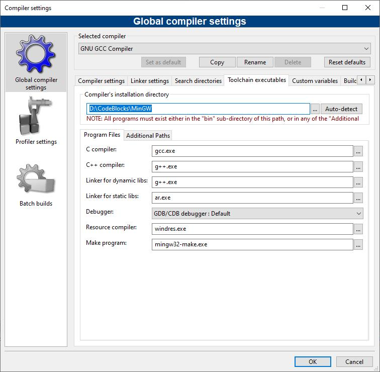
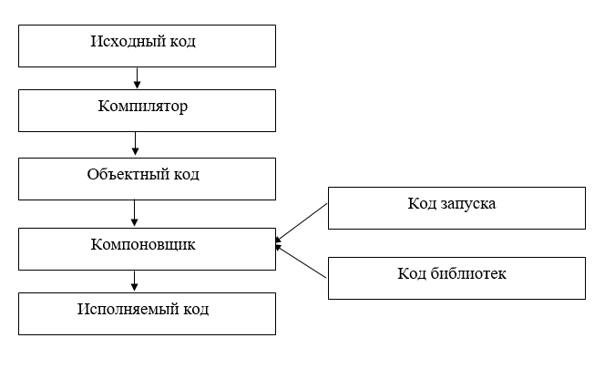

# Лекция 1: Основы C++

## 1. Системы счисления

### Двоичная (2-чная) система
- Основание: 2
- Цифры: 0, 1
- Пример: `1010₂ = 1×2³ + 0×2² + 1×2¹ + 0×2⁰ = 10₁₀`
- Применение: низкоуровневое программирование, аппаратное обеспечение

### Десятичная (10-чная) система
- Основание: 10
- Цифры: 0-9
- Пример: `42₁₀ = 4×10¹ + 2×10⁰`

### Шестнадцатеричная (16-чная) система
- Основание: 16
- Цифры: 0-9, A-F (где A=10, F=15)
- Пример: `1F₈ = 1×16¹ + 15×16⁰ = 31₁₀`
- Применение: сокращенная запись двоичных данных, цветовые коды

## 2. Краткая история C++
- 1979: Создан язык C (Деннис Ритчи)
- 1983: Бьярне Страуструп добавляет ООП к C → C++
- 1998: Первый стандарт C++98
- Современные стандарты: C++11, C++14, C++17, C++20

## 3. Основные компоненты C++
### Характеристика языка:
C++ — **мультипарадигмальный** язык, поддерживающий:
- **Процедурное программирование** (наследие C)
- **Объектно-ориентированное программирование (ООП)**:  
Инкапсуляция, наследование, полиморфизм, абстракция
- **Обобщенное программирование**: шаблоны (`templates`)
- **Императивное программирование**

### Ключевые особенности:
- Совместимость с C (прямое использование C-кода)
- Низкоуровневый контроль памяти (`new`/`delete`)
- Высокая производительность
- Статическая типизация
- Стандартная библиотека (STL)

## 4. Среда разработки: Code::Blocks + MinGW
### Установка
1. Скачать Code::Blocks с MinGW c официального сайта: **https://www.codeblocks.org/downloads/ -> Download the binary release -> codeblocks-25.03mingw-setup.exe**
Лучше скачивать сразу версию с компилятором.
2. Установить, выбрав компонент MinGW
3. Проверить путь к компилятору (Settings → Compiler)
Также проверить настройки:
Компилятор: GNU GCC Compiler
Settings -> Editor -> Encoding Settings -> UTF8

### Как заменить компилятор в Code::Blocks для Windows
При попытке использовать некоторые компоненты С++, утвержденные последними стандартами языка (например, <future> или <filesystem>), вы можете столкнуться с тем, что встроенный в Code::Blocks компилятор GCC MinGW эти компоненты полноценно не поддерживает. Дело в том, что компилятор достаточно старый. Но его можно заменить! Показываю самый простой, на мой взгляд, вариант.
1. Скачиваем вот отсюда https://github.com/niXman/mingw-builds-binaries/releases готовую сборку компилятора. Предлагаю выбрать или 64-битную версию https://github.com/niXman/mingw-builds-binaries/releases/download/14.2.0-rt_v12-rev0/x86_64-14.2.0-release-win32-seh-msvcrt-rt_v12-rev0.7z, или 32-битную https://github.com/niXman/mingw-builds-binaries/releases/download/14.2.0-rt_v12-rev0/i686-14.2.0-release-win32-dwarf-msvcrt-rt_v12-rev0.7z
2. Распаковываем куда-нибудь, желательно в корневой каталог какого-нибудь логического диска. Получаем, например, каталог C:\mingw64, в котором живет готовый к использованию компилятор.
3. Открываем Code::Blocks, выбираем в меню Settings > Compiler..., а затем открываем вкладку "Toolchain Executables" (см. скриншот).
4. Меняем указанный в строке "Compiler's Installation Directory" путь на тот, куда распаковали в п. 
2 новый компилятор.
5. Закрываем окно, закрываем Code::Blocks. При очередном открытии Code::Blocks компилятор должен измениться, в результате вы сможете пользоваться самыми последними нововведениями языка C++.
Compiler-Default.png



### Преимущества
- Бесплатная и open-source
- Кроссплатформенность
- Поддержка нескольких компиляторов

### Какие бывают среды разработки ещё:
- Visual Studio (Microsoft)
- VSCode (текстовый редактор)
- Q+
- C++ Builder(Rad Studio)
- Eclipse


## 5. Схема процесса компиляции и выполнения программы на C++:


---
Это схема, описывающая процесс компиляции, сборки и выполнения программы в компилируемых языках программирования (например, C++, C). Вот расшифровка каждого этапа:

1. **Исходный код**
Текстовые файлы с инструкциями на языке программирования (например, .cpp, .h).

2. **Компилятор**
Программа (например, g++, clang), которая переводит исходный код в объектный код (машинно-читаемый бинарный файл, например, .obj или .o).
Задача: Проверка синтаксиса, оптимизация, генерация промежуточного кода.

3. **Объектный код**
Промежуточный бинарный файл, который содержит машинные инструкции, но ещё не готов к запуску.
Особенность: Может ссылаться на внешние функции (например, из библиотек), которые не разрешены на этом этапе.

4. **Компоновщик (линкер)**
Программа (ld в Unix-системах), которая объединяет:
- Объектные файлы
- Статические библиотеки (.lib, .a)

    Решает внешние ссылки (например, подключает функции из стандартной библиотеки).
    Результат: Исполняемый файл (например, .exe в Windows, без расширения в Linux).

5. **Исполняемый код**
Готовый файл, который можно запустить в операционной системе. Содержит полный машинный код и данные для работы программы.

6. **Код запуска**
Часть программы, которая выполняется перед функцией main().
Что включает:
- Инициализацию глобальных переменных,
- Настройку стека,
- Подготовку аргументов командной строки.

7. ****Код библиотек**
Внешние библиотеки, которые используются программой:
- Статические (включаются в исполняемый файл на этапе компоновки),
- Динамические (подгружаются во время выполнения, например, .dll, .so).

### Как это работает вместе:
1. Программист пишет исходный код.
2. Компилятор превращает его в объектный код.
3. Компоновщик связывает объектные файлы с кодом библиотек, создавая исполняемый код.
4. При запуске программы выполняется код запуска, затем управление передаётся в main().
5. Во время работы программа может использовать функции из динамических библиотек.


## 6. Первая программа на C++
```cpp
#include <iostream> // Стандартная библиотека ввода/вывода
using namespace std;

int main() { // Главная функция программы, функция запуска
    setlocale(LC_ALL, "Russuain") // строчка, для вывода на русском языке
    cout << "Привет мир!" << endl; // Вывод текста
    return 0; // Код завершения
}
```

### Разбор программы:
- `#include` - директива препроцессора
- `main()` - точка входа
- `cout` - поток вывода
- `<<` - оператор вывода
- `endl` - конец строки
- `int` - тип данных который возращает функция


## 7. Алфавит языка C++
- Латиница (A-Z, a-z)
- Цифры (0-9)
- Спецсимволы: {}[](),.;:+-*/%=&|<>!~^#''""

### Правила идентификаторов:
- Не начинаются с цифры
- Чувствительность к регистру
- Нельзя использовать ключевые слова (int, return и т.д.)

## 8. Основные типы данных

| Тип          | Размер (байты) | Диапазон/Характеристики                          |
|--------------|----------------|--------------------------------------------------|
| `bool`       | 1              | `true` (1) / `false` (0)                         |
| `char`       | 1              | -128 до 127 (`signed`) <br> 0 до 255 (`unsigned`)|
| `short int`  | 2              | -32,768 до 32,767                                |
| `int`        | 4              | -2³¹ до 2³¹-1 (≈-2.1e9 до 2.1e9)                |
| `unsigned int`| 4             | 0 до 4,294,967,295                               |
| `long`       | 4 или 8*       | -2³¹ до 2³¹-1 (4 байта) <br> -2⁶³ до 2⁶³-1 (8 байт)|
| `__int64`    | 8              | -9,223,372,036,854,775,808 до 9,223,372,036,854,775,807 (MSVC)|
| `int64_t`    | 8              | То же, что `__int64` (стандарт C++11, `<cstdint>`)|
| `float`      | 4              | ~7 значащих цифр (IEEE-754)                      |
| `double`     | 8              | ~15 значащих цифр (IEEE-754)                     |
| `string`     | Динамический   | Класс для работы с ASCII-строками (`std::string`) |
| `wstring`    | Динамический   | Класс для Unicode-строк (`std::wstring`, `wchar_t`)| 

### Примечания:
1. **`long`**: Размер зависит от ОС и компилятора:
   - 4 байта в 32-битных системах (Windows, Linux).
   - 8 байт в 64-битных Linux, но 4 байта в 64-битных Windows.
2. **`__int64`**: Специфичен для компиляторов Microsoft.
3. **`string`/`wstring`**:
   - Не являются примитивными типами (реализованы через классы в `<string>`).
   - `wstring` использует `wchar_t` (2 байта в Windows, 4 в Linux).
4. **`int64_t`**: Гарантирует точный размер 64 бита (требует `<cstdint>`).
5. Типы с динамическим размером (`string`, `wstring`) выделяют память в куче.
---

### Модификаторы типов: подробное объяснение

#### 1. **`signed` / `unsigned`**  
**Что это?**  
Модификаторы, определяющие, может ли тип хранить отрицательные значения:  
- **`signed`** (знаковый): хранит и положительные, и отрицательные числа (по умолчанию для `int`, `char`).  
- **`unsigned`** (беззнаковый): хранит только неотрицательные числа (расширяет максимальное положительное значение).  

**Примеры:**  
```cpp
signed int a = -10;   // Диапазон: -2³¹ до 2³¹-1
unsigned int b = 42;  // Диапазон: 0 до 4,294,967,295
unsigned char c = 200; // 0 до 255 (вместо -128 до 127)
```

**Зачем использовать?**
- Экономия памяти для неотрицательных данных (например, счётчики, индексы).
- Увеличение максимального значения для переменной.
- Повышение читаемости кода (явное указание, что значение не может быть отрицательным).
---

### 2. `short` / `long`

#### **Что это?**  
Модификаторы, изменяющие размер типа данных:  
- `short` (короткий): уменьшает размер типа (экономит память, но сужает диапазон).  
- `long` (длинный): увеличивает размер типа (расширяет диапазон, но требует больше памяти).  


#### **Примеры:**  
```cpp
short int s = 32767;      // Диапазон: -32,768 до 32,767 (2 байта)
long int l = 2147483647;  // Диапазон: -2³¹ до 2³¹-1 (4 байта)
long double ld = 3.14;    // 10-байтовое число (повышенная точность)
```

Зачем использовать?

**short:**
- Для оптимизации памяти (например, массивы из тысяч элементов).
- Работа с данными фиксированного размера (бинарные протоколы, файловые форматы).

**long:**
- Для хранения очень больших чисел (например, timestamp).
- Повышение точности (long double для научных расчётов).

---
### Советы:
- лучше инициализирвоать в точке объявления
- лучше объявлять в точке использования
- sizeof() функция, позволяющая узнать сколько места занимает
- короткие переменные использовать только в счётчике. Название должно передавать смысл, что делает
- использовать первую букву нижнего регистра в переменных, а первую букву верхнего регистра в константах


## Литература

1. **Шилдт Г.**  
   *C++: Полный справочник* (англ. "C++: The Complete Reference")  
   — классический справочник по языку C++.

2. **Прата С.**  
   *C++ Primer Plus* (6-е издание, 2012)  
   — учебник для начинающих и продвинутых разработчиков.

3. **Мейерс С.**  
   *Эффективное использование C++* (англ. "Effective C++: 55 Specific Ways to Improve Your Programs and Designs")  
   — практические рекомендации по написанию качественного кода.

4. **Саттер Г., Александреску А.**  
   *Стандарты программирования на C++* (англ. "C++ Coding Standards: 101 Rules, Guidelines, and Best Practices")  
   — свод правил и лучших практик.

5. **Макконнелл С.**  
   *Совершенный код* (англ. "Code Complete: A Practical Handbook of Software Construction")  
   — фундаментальная книга о профессиональной разработке ПО.

---


## Первые задания :)
### 1.1 📋 Задание: Маленькое сочинение о себе.
Что нужно написать:
- ФИО
- Группа
- специальность
- email
- телефон
- школа и год её окончания
- сдавали ли ЕГЭ по информатике, если да, то на сколько баллов
- где и когда изучали языки программирования (если изучали)
- есть ли практический опыт
- какой у вас склад ума (по вашему мнению) (Аналитик или Созидатель)
- есть ли жедание изучать программирование глубоко?

### 1.2  📋 Задание: "Утренний ритуал" 
 *Разработка алгоритма, блок-схемы и программы на C++*

**Цель задания**
Реализовать алгоритм ежедневного утреннего ритуала с использованием:
- 2 проверок условий
- 1 цикла
- 5 функций (в 2+ файлах)
- Заголовочных файлов
- Архива проекта* (без `bin/` и `obj/`)
- Нарисовать **Блок-схему алгоритма**
